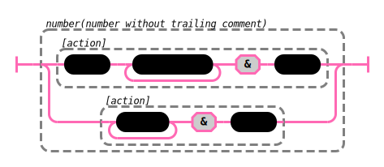

# peggy-tracks

`peggy-tracks` creates railroad track diagrams of [peggy](https://peggyjs.org/) grammars.

## Example

A quick example, generated with `peggy-tracks -s comment`:


Alternately, you can have rule references expanded using `-e`:


## Installation

```bash
npm install -g peggy-tracks
```

## Command line

```
Usage: peggy-tracks [options] [input_file]

Options:
  -a,--action              Wrap actions in a box
  -c,--css [file name]     With no file name, outputs the default CSS.  With a
                           filename, substitutes the CSS in that file.
  -d,--depth <number>      Maximum depth to expand references (set to Infinity
                           with --expand).
  -e,--expand              Expand rule references
  -o,--output <file name>  File in which to save output
  -s,--start <rule name>   Rule to start with
  -h, --help               display help for command
```

## More control

To change the look and feel of the output, you can output the default CSS that
will be placed in the SVG:

```sh
peggy-tracks -c > my.css
```

Edit `my.css`, and pass it back in to peggy-tracks:

```sh
peggy-tracks -c my.css --action -o action.svg -s number test.peggy
```

Generates this:



Note that the `--action` flag has created extra boxes around parts of the
grammar, that when moused over show the code that will be executed when the
fragment matches.

## API

Only supports module-style:

```js
import {tracks, defaultCSS} from "peggy-tracks";

const diagram = tracks({
  // "text" is the only required option
  text: `
foo = bar*
bar = n:[0-9] { return parseInt(n) }
`,
  start: "bar",
  action: true,
  expand: false,
  parserOptions: {
    grammarSource: "filename"
  },
});

console.log(diagram.toStandalone(`
/* Optional: Full CSS desired.  If none specified, uses defaultCSS */
svg {
  background-color: hsl(30,20%,95%);
}
...
`));
```

[](https://github.com/peggyjs/peggy-tracks/actions/workflows/node.js.yml)
[](https://codecov.io/gh/peggyjs/peggy-tracks)
